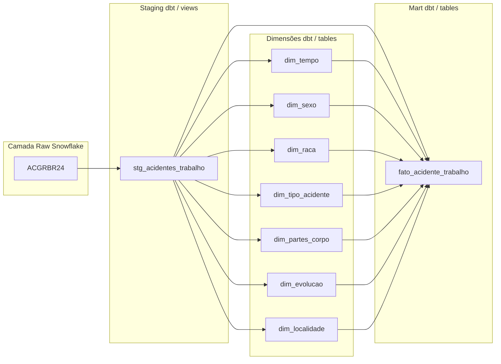

# ACGRBR24 – Acidente de Trabalho | Snowflake + dbt (Bootcamp 2025)

Repositório do desafio final (Tema: **Acidente de Trabalho – ACGRBR24**).  
Pipeline construído em **Snowflake**, com transformações e modelagem dimensional via **dbt**.  
> O painel em Power BI é opcional e pode ser adicionado posteriormente.

---

##  Arquitetura do Pipeline

Este projeto segue uma arquitetura moderna de dados, dividida em quatro camadas principais:

- **Raw (Snowflake)**: Dados brutos carregados diretamente da fonte.
- **Staging (dbt/views)**: Limpeza e padronização dos dados.
- **Dimensões (dbt/tables)**: Tabelas dimensionais que descrevem os atributos dos acidentes.
- **Mart (dbt/tables)**: Tabela fato que consolida os dados para análise.


 ## Coleta e Ingestão de Dados (DataSUS)

Nesta etapa, foi realizada a coleta, preparação e ingestão dos dados do **SINAN – ACGRBR (Acidente de Trabalho Grave) – ano de 2024** no **Snowflake**, seguindo as boas práticas de um pipeline de dados e simulando um *data lake* na camada de **stage interno**.

---

## **1️⃣ Coleta dos dados (DataSUS)**
1. Acessar o portal do **SINAN – DataSUS** e realizar o download do conjunto de dados **ACGRBR – 2024**.  
2. Baixar também os **arquivos auxiliares para tabulação** fornecidos pelo DataSUS, que contêm:
   - Conversor de arquivos `.DBC` para `.DBF`.
   - Dicionários de dados e layouts para interpretação dos campos.
3. Os arquivos de documentação utilizados foram:
   - [Dicionário de Dados – Acidente de Trabalho Grave (DRT)](https://portalsinan.saude.gov.br/images/documentos/Agravos/DRT%20Acidente%20Trabalho%20Grave/DIC_DADOS_DRT_Acidente_Trabalho_grave_v5.pdf)
   - **DIC_DADOS_NET – Notificação Individual** (arquivo local baixado do portal)

---

## **2️⃣ Conversão para CSV**
Para permitir a leitura dos dados no Snowflake, foi necessário converter o formato original (`.DBF`) para `.CSV`:

1. Utilizar o conversor disponibilizado pelo DataSUS para transformar `.DBC` em `.DBF`.
2. Executar o script Python [`ingest/python/convert_DBF_CVS.py`](ingest/python/convert_DBF_CVS.py) para converter `.DBF` → `.CSV`.  
   - Este script utiliza a biblioteca **pandas** em conjunto com **simpledbf** para realizar a leitura e exportação do arquivo.
3. O arquivo resultante **ACGRBR24.csv** foi salvo localmente para ingestão.

---

## **3️⃣ Ingestão no Snowflake**
A ingestão foi realizada utilizando **Worksheets** no Snowflake, simulando um *data lake* com o uso de um **stage interno**.

1. **Criação do banco e schema:**
   ```sql
   CREATE DATABASE IF NOT EXISTS ACIDENTES_DB;
   CREATE SCHEMA IF NOT EXISTS ACIDENTES_DB.RAW;
   
2. **Criação do formato de arquivo e do stage interno**
(Código em ingest/sql/01_create_stage_and_format.sql)

3. **Upload do arquivo CSV para o stage interno* (PUT command via SnowSQL ou upload via interface)

4. **Carga dos dados para a tabela RAW:**

ingest/sql/02_copy_into_acidentes_trabalho_raw.sql

ingest/sql/03_copy_into_acidentes_trabalho_raw.sql


  ## Como Rodar o Projeto 
Obs: projeto foi feito no dbt cloud.
  #### DBT Cloud
Configure a conexão Snowflake (Account, User, Role, Warehouse, Database, Schema).
Execute no Run Command Bar (barra).
dbt deps .
dbt build (compila/roda modelos e testes).
dbt docs generate (gera o site de documentação).


