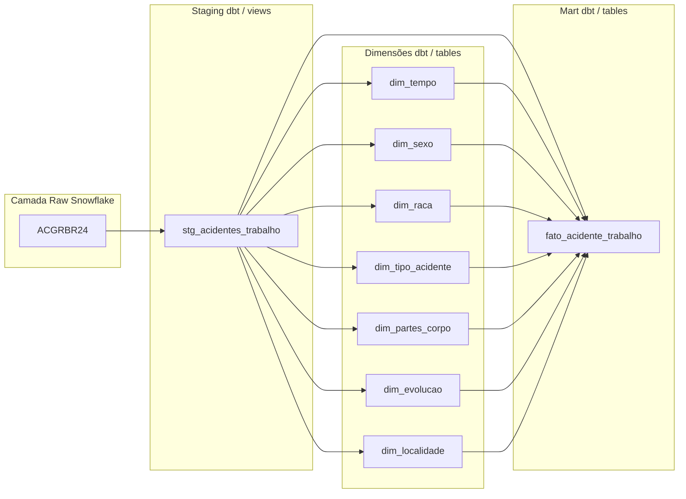

# ACGRBR24 – Acidente de Trabalho | Snowflake + dbt (Bootcamp 2025)

Repositório do desafio final (Tema: **Acidente de Trabalho – ACGRBR24**).  
Pipeline construído em **Snowflake**, com transformações e modelagem dimensional via **dbt**.  

---

 ## Coleta e Ingestão de Dados (DataSUS)

Nesta etapa, foi realizada a coleta, preparação e ingestão dos dados do **SINAN – ACGRBR (Acidente de Trabalho Grave) – ano de 2024** no **Snowflake**, seguindo as boas práticas de um pipeline de dados e simulando um *data lake* na camada de **stage interno**.

---

#### ** Coleta dos dados (DataSUS)**
1. Acessar o portal do **SINAN – DataSUS** e realizar o download do conjunto de dados **ACGRBR – 2024**.  
2. Baixar também os **arquivos auxiliares para tabulação** fornecidos pelo DataSUS, que contêm:
   - Conversor de arquivos `.DBC` para `.DBF`.
   - Dicionários de dados e layouts para interpretação dos campos.
3. Os arquivos de documentação utilizados foram:
   - [Dicionário de Dados – Acidente de Trabalho Grave (DRT)](https://portalsinan.saude.gov.br/images/documentos/Agravos/DRT%20Acidente%20Trabalho%20Grave/DIC_DADOS_DRT_Acidente_Trabalho_grave_v5.pdf)
   - **DIC_DADOS_NET – Notificação Individual** (arquivo local baixado do portal)

---

#### ** Conversão para CSV**
Para permitir a leitura dos dados no Snowflake, foi necessário converter o formato original (`.DBF`) para `.CSV`:

1. Utilizar o conversor disponibilizado pelo DataSUS para transformar `.DBC` em `.DBF`.
2. Executar o script Python [`ingest/python/convert_DBF_CVS.py`](ingest/python/convert_DBF_CVS.py) para converter `.DBF` → `.CSV`.  
   - Este script utiliza a biblioteca **pandas** em conjunto com **simpledbf** para realizar a leitura e exportação do arquivo.
3. O arquivo resultante **ACGRBR24.csv** foi salvo localmente para ingestão.

---

#### ** Ingestão no Snowflake**
A ingestão foi realizada utilizando **Worksheets** no Snowflake, simulando um *data lake* com o uso de um **stage interno**.

1. **Criação do banco e schema e criação do formato de arquivo e do stage interno**
(Código em ingest/sql/01_create_stage_and_format.sql)

2. **Upload do arquivo CSV para o stage interno** (PUT command via SnowSQL ou upload via interface)

3. **Carga dos dados para a tabela RAW:**

ingest/sql/02_copy_into_acidentes_trabalho_raw.sql

ingest/sql/03_copy_into_acidentes_trabalho_raw.sql

##  Arquitetura do Pipeline

Este projeto segue uma arquitetura moderna de dados, dividida em quatro camadas principais:

- **Raw (Snowflake)**: Dados brutos carregados diretamente da fonte.
- **Staging (dbt/views)**: Limpeza e padronização dos dados.
- **Dimensões (dbt/tables)**: Tabelas dimensionais que descrevem os atributos dos acidentes.
- **Mart (dbt/tables)**: Tabela fato que consolida os dados para análise.

##  Recursos avançados do Snowflake

Esta seção demonstra, com scripts e validações, três recursos-chave do Snowflake aplicados ao projeto:

Time Travel: consultar uma tabela “como ela estava antes”.  

Zero-Copy Clone: clonar tabelas instantaneamente, sem copiar dados. 

Clustering: definir chaves de cluster para melhorar filtros/varredura por partições.    

Todos os comandos abaixo podem ser executados no worksheet do snowflake com o WAREHOUSE habilitado. 

#### Time Travel

O que é: possibilidade de consultar objetos como estavam em um ponto no tempo anterior (dentro da janela de retenção configurada).  
Demo que rodamos:   
Criamos uma cópia de trabalho de FATO_ACIDENTE_TRABALHO (TT_DEMO).  
Registramos um timestamp “ANTES”.   
Removemos 1.000 linhas para gerar histórico.    
Comparamos a contagem AGORA vs ANTES (TT).  
codigo em ['platform/time_travel.sql'](platform/time_travel.sql).   

#### Zero Copy Clone

Durabilidade precisa combinar: se a origem é TRANSIENT, o clone também deve ser TRANSIENT.  
Não é permitido “promover” transient → permanent via clone. 
codigo em ['platform/zero_copy.sql'](platform/zero_copy.sql).   

##  Transformação e Modelagem de Dados com dbt  

Transformar os dados brutos de acidentes de trabalho (DataSUS — DRT Acidente de Trabalho Grave) em um modelo dimensional otimizado para análise, utilizando o dbt.
O modelo permite análises sobre frequência, local, causas e consequências dos acidentes.

### Arquitetura da Modelagem

Foi adotada a modelagem Star Schema com:    
Tabela Fato 
fato_acidente_trabalho  
Contém as ocorrências de acidentes de trabalho.
Inclui chaves substitutas (id_acidente gerado via md5_hex) e medidas como:
qtd_trabalhadores_evento    
dt_acid (data do acidente)  
cid_acid, cid_lesao (CID-10 da causa e lesão)   
sg_uf, mun_acid (UF e município)    
tipo_acid, evolucao, cat (tipo de acidente, evolução do caso, emissão da CAT)  

#### Tabelas Dimensão   

dim_tempo — Datas dos eventos (permitindo análise temporal).    
dim_localidade — UF e município onde ocorreu o acidente.        
dim_sexo — Código e descrição do sexo.  
dim_raca — Raça/cor.    
dim_tipo_acidente — Classificação do acidente.  
dim_partes_corpo — Partes do corpo atingidas.   
dim_evolucao — Situação final do caso.  

### Pipeline no dbt 

A modelagem foi dividida em três camadas:   
Staging (stg_*) 
Padronização de campos (datas com try_to_date, códigos em uppercase, trim). 
Seleção apenas dos campos relevantes.   
Fonte: source('raw', 'acidentes_trabalho_raw'). 
Intermediate (int_*)    
Tratamento intermediário (normalização, enriquecimento).    
Exclusão de registros inconsistentes.   
Mart (fato_* e dim_*)   
Junção com dimensões.   
Geração de chaves substitutas (md5_hex de múltiplos campos).    
Deduplicação (row_number() para manter apenas um registro por combinação única de atributos).   
Aplicação de materialização table no fato e view nas dimensões. 

### Testes Implementados    

Utilizando dbt tests e pacotes externos (dbt_utils, dbt_expectations):

Qualidade de dados: 
not_null para campos obrigatórios.  
unique para chaves substitutas.     
accepted_values conforme dicionário DataSUS.    
expect_column_values_to_be_between para validar intervalos de datas.    
Validação de integridade:   
Conferência de correspondência entre códigos do fato e dimensões.

  ## Como Rodar o Projeto 
Obs: projeto foi feito no dbt cloud.
  #### DBT Cloud
Configure a conexão Snowflake (Account, User, Role, Warehouse, Database, Schema).
Execute no Run Command Bar (barra).
dbt deps .
dbt build (compila/roda modelos e testes).
dbt docs generate (gera o site de documentação).

