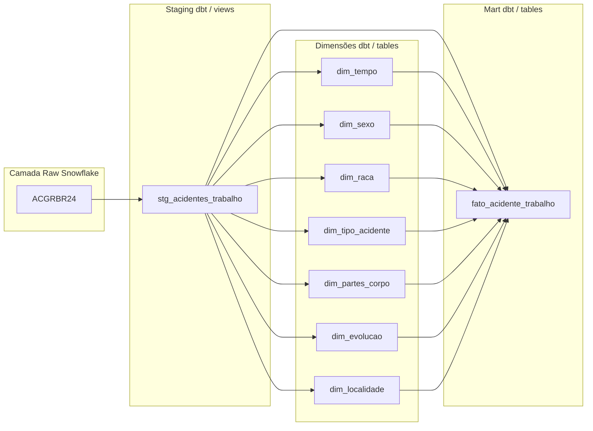

# ACGRBR24 – Acidente de Trabalho | Snowflake + dbt (Bootcamp 2025)

Repositório do desafio final (Tema: **Acidente de Trabalho – ACGRBR24**).  
Pipeline construído em **Snowflake**, com transformações e modelagem dimensional via **dbt**.  
> O painel em Power BI é opcional e pode ser adicionado posteriormente.

---

##  Arquitetura do Pipeline

Este projeto segue uma arquitetura moderna de dados, dividida em quatro camadas principais:

- **Raw (Snowflake)**: Dados brutos carregados diretamente da fonte.
- **Staging (dbt/views)**: Limpeza e padronização dos dados.
- **Dimensões (dbt/tables)**: Tabelas dimensionais que descrevem os atributos dos acidentes.
- **Mart (dbt/tables)**: Tabela fato que consolida os dados para análise.

  ## Como Rodar o Projeto 
Obs: projeto foi feito no dbt cloud.
  #### DBT Cloud
Configure a conexão Snowflake (Account, User, Role, Warehouse, Database, Schema).
Execute no Run Command Bar (barra):
dbt deps
dbt build (compila/roda modelos e testes)
dbt docs generate (gera o site de documentação)

